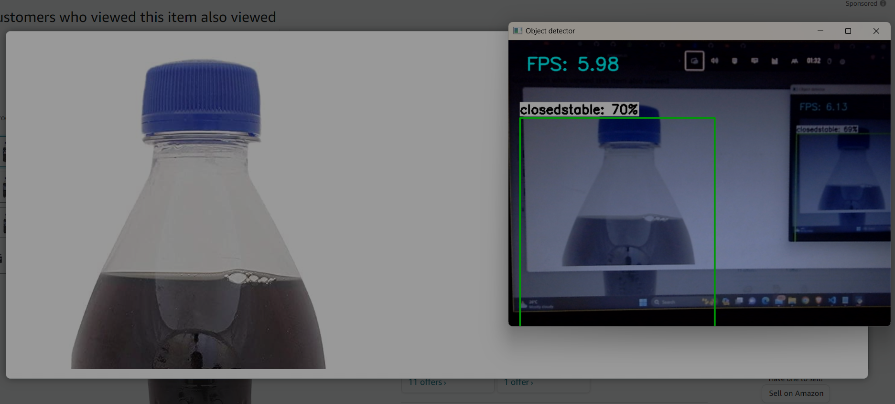

# Deep Learning-based Thumb Up (ThumsUp) Level Detection

## Abstract

This project focuses on the development of a deep learning model for the automatic detection of ThumsUp bottles in an industrial setting. ThumsUp bottles come in various variations, and the goal was to create a robust system capable of identifying different classes of these bottles. The project includes data collection, annotation, augmentation, model training, and deployment on edge devices.

## 1. Introduction

The primary objective of this project is to create a reliable system for identifying ThumsUp bottles within an industrial environment using deep learning techniques. The system is designed to run efficiently on low computational devices, such as Arduino, for real-world applications.

## 2. Data Collection

Real-world images of ThumsUp bottles with various variations were collected. It is essential to ensure that the dataset is representative of the actual use case to build a model that generalizes well.

## 3. Data Annotation

The collected data was annotated to create labeled datasets for training. Annotation involves marking regions of interest (ThumsUp bottles) in the images and associating class labels with them. This step is crucial for supervised learning.

## 4. Data Augmentation

Data augmentation techniques were applied to increase the size of the dataset and create variations of the images. Techniques like rotation, scaling, and flipping were used to ensure the model's robustness to different orientations and conditions.

## 5. Model Selection

A pre-trained SSD MobileNet model was chosen for this project. SSD (Single Shot MultiBox Detector) is an object detection model known for its speed and accuracy. MobileNet is a lightweight architecture, making it suitable for deployment on low-power devices.

## 6. Model Fine-Tuning

The selected model was fine-tuned using the annotated dataset. The pre-trained weights were used as a starting point, and the model was trained to detect the seven classes of ThumsUp bottles with different variations.

## 7. Evaluation

The model's performance was evaluated using metrics such as Mean Average Precision (mAP) to measure its accuracy and effectiveness. Achieving an 80% mAP indicates a strong model.

## 8. Model Conversion

After training, the model was saved in the TensorFlow SavedModel format. This format is a standard for saving models and allows for easy conversion to other formats.

## 9. TensorFlow Lite Conversion

The saved model was converted into TensorFlow Lite format to optimize it for deployment on edge devices. TensorFlow Lite is designed for running machine learning models on low-power devices, making it a suitable choice for the Arduino platform.

## 10. Deployment

The model was deployed on a Windows system, and logic was implemented to process video frames in real-time. For each frame, the model detected the ThumsUp bottles and recorded their class names in left-to-right order.

## 11. Real-World Application

In a real-world scenario, the list of detected class names serves as valuable information. The first element in the list indicates the left-most ThumsUp bottle's class. This information can be sent to Arduino or any other control system to trigger specific actions related to the identified bottle.

## 12. Conclusion

This project successfully developed a deep learning-based system for ThumsUp bottle detection in an industrial setting. It involved collecting data, annotating it, training a deep learning model, and deploying it on low-power edge devices. The system's real-world application includes automating actions based on the detected ThumsUp bottles, improving efficiency and accuracy in an industrial context.

## 13. Future Work

Future work could involve further optimizing the model for even lower computational devices and exploring additional use cases for object detection within industrial environments.

## Images

